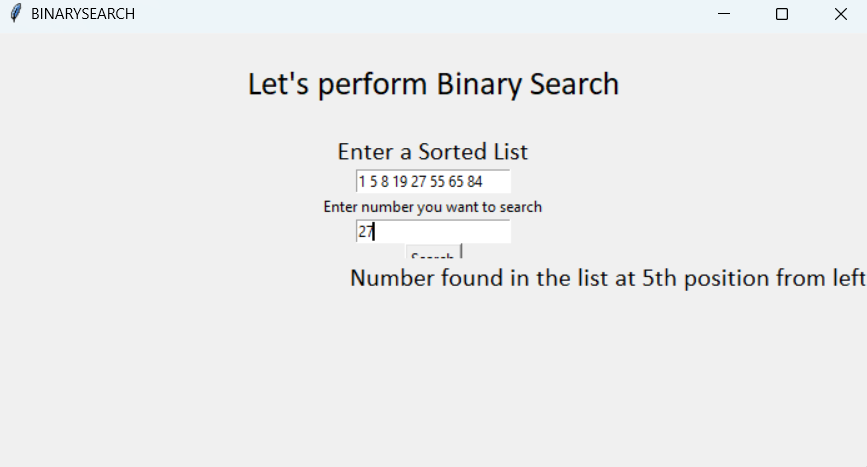

## 🧮 Binary Search – Python Project with Tkinter

#### A clean and interactive implementation of the Binary Search Algorithm, built using Python’s Tkinter GUI library. Perfect for beginners who want to understand how binary search works step-by-step with visual feedback.

## 👀 Binary Search Tkinter GUI
# 🚀 Features
🖥️ User-friendly GUI built with tkinter
💡 Educational & beginner-friendly code
🌙 Lightweight and fun to explore!

## 🛠️ Tech Stack
🐍 Python 3.x

🪟 Tkinter – for building the GUI

📐 Binary Search Algorithm – implemented in Python

📚 How It Works
Enter a sorted list of numbers.

Input a target value you want to search.

Click "Search" – and watch the algorithm in action!

📸 Screenshots

🎓 Educational Value
This project is a great tool to:

Understand the logic and steps of binary search

Practice building simple, interactive Python GUIs

👨‍💻 Made By
Sarthak Bora
