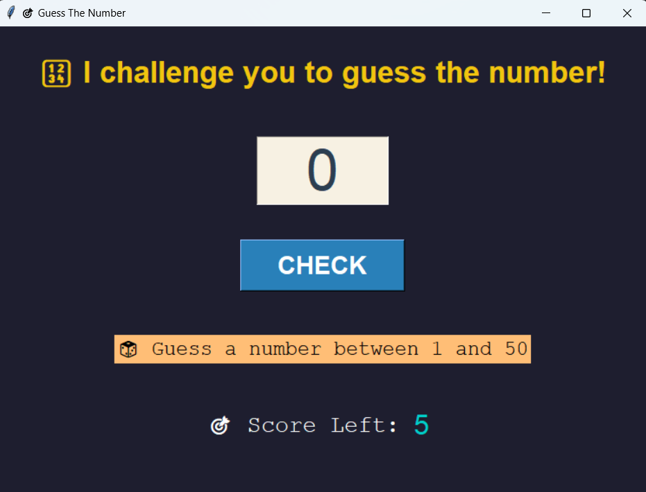

# 🎮 Guess The Number - Python Game with Tkinter

A simple and fun **Guess the Number** game built using Python's `tkinter` GUI library and the `random` module. Test your luck and intuition as you try to guess the computer-generated number!

---

## 🚀 Features

- 🎲 Random number generation every game
- 🧠 Feedback after every guess (Too high / Too low / Correct!)
- 🖥️ User-friendly graphical interface using `tkinter`
- 🔁 Option to play again without restarting the program
- 🌙 Lightweight and beginner-friendly code
- 5️⃣ Chances each time you run the code
- 😁 Enjoy!!!

## 📸 Screenshots

## 🛠️ Tech Stack

- **Python 13.8.5**
- **tkinter** – for GUI
- **random module** – to generate the mystery number

---

## 🧩 How to Play

1. Run the game using Python.
2. Enter your guess between the given range.
3. Get hints: "Too High" or "Too Low".
4. Guess until you find the right number!
5. Play again as much as you'd like.

# MadeBy -- Sarthak Bora  
